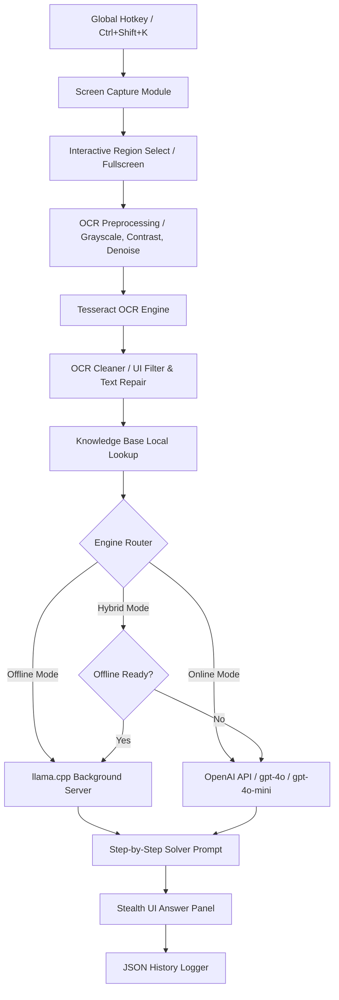

# FocusFlow 🪐

[](https://python.org)
[](https://microsoft.com/windows)
[](LICENSE)
[](online_engine.py)

FocusFlow is an ultra-stealth, hybrid offline-online educational assistance tool designed for Windows. It captures selected screen regions, runs a high-fidelity OCR preprocessing pipeline, cleans structural layout artifacts, queries local knowledge bases, and routes the context to an AI engine (either a local background `llama.cpp` model or a key-rotated OpenAI `gpt-4o` / `gpt-4o-mini` online client) to methodically solve exam and study questions in real-time.

---

## 🔮 Core Features

### 🛡️ 1. Screen Capture Evasion (Stealth HUD)
- **Zero-Window Display Affinity**: Utilizing ctypes and the Win32 API, FocusFlow applies `WDA_EXCLUDEFROMCAPTURE` dynamically to its HUD windows. The panels are completely invisible to screenshots, video recordings, and screen-sharing applications (Discord, Teams, Zoom, etc.).
- **Transparent Drag-Select**: Trigger an interactive, semi-transparent region capture overlay to target specific question areas on your monitor.

### 👁️ 2. High-Fidelity OCR Preprocessing & Cleaning
- **Multi-Stage Preprocessing Pipeline**: Converts screenshots to grayscale, boosts contrast (×1.5), sharpens, applies median noise reduction, and performs binary thresholding for near-perfect character detection under Tesseract.
- **Smart Cleaner**: Collapses layout spaces, resolves typical OCR misidentifications, filters garbage/UI text (e.g. "Netlify", "Discord", "Gemini"), and strips non-printable junk characters.

### 🧠 3. Hybrid AI Solving Engine
- **Offline Backend**: Launches a silent `llama-server.exe` subprocess in the background with `CREATE_NO_WINDOW` flags, serving `Phi-3-mini-4k-instruct-q4.gguf` locally.
- **Online API (`gpt-4o`/`gpt-4o-mini`)**: Integrates standard OpenAI chat completions with vision payload optimization (automatic image resizing to 1280px JPEG and quality 85 compression to reduce network latency).
- **API Key Rotation & Retry**: Supports multiple OpenAI API keys in a rotation pool, automatically rotating keys and applying exponential backoff delay during rate limits or status `429` errors.

### 🎛️ 4. Premium Dark HUD UI
- Draggable glassmorphic borderless panels with macOS-inspired title bars.
- Live opacity slider (range 50-255) for dynamic HUD blending.
- Embedded Manual Question Drawer for quick text queries without screen capture.
- Configurable global hotkeys for capturing, panel visibility toggles, settings, and opacity adjustments.

---

## 🏗️ Architecture Flow



---

## 🌐 Premium SaaS Landing Page

The repository includes a world-class, premium SaaS landing page located in the `landing/` directory. It is designed to look custom-built, futuristic, and highly interactive.

### Features
- **Mouse-Reactive Follow Glow**: An ambient light glow that tracks the user's mouse pointer using GPU-accelerated springs (`framer-motion`).
- **Canvas Particle Background**: A floating particle field written using pure Canvas and HTML5 2D contexts for high-performance 60fps animations.
- **Active Pomodoro Widget**: A fully interactive desktop-like Pomodoro timer in the hero section that can be started, paused, and reset.
- **Dynamic Metrics Charts**: Multi-tab SVG line graphs showing study progress, focus scores, and distraction count with animated transition paths.
- **Study Heatmap Grid**: Hover-interactive grid depicting study consistency across days and weeks, with floating hover tooltips.
- **Perspective Sandbox Carousel**: Auto-scrolling slides demonstrating core product interfaces (Stealth HUD, Socratic Tutor, Search History) using perspective rotates.

### Technology Stack
- **Framework**: Next.js 16 (App Router, Turbopack) & TypeScript
- **Styling**: TailwindCSS v4 with glassmorphism overlays and ambient glow effects
- **Animations**: Framer Motion & HTML5 Canvas

### Running Locally
To launch the landing page locally:
1. Navigate to the `landing/` folder.
2. Install the dependencies and compile the production build:
   ```powershell
   npm install
   npm run build
   ```
3. Run the development server:
   ```powershell
   npm run dev
   ```

---

## 🚀 Setup & Installation

### Option A: Standalone Executable (Recommended)
No Python installation or dependency setup is required. 

1. **Choose & Download a Release Package**:
   - **Lite Release (`FocusFlow-v1.0.0-LITE.zip`)** [~77 MB]: Contains the precompiled standalone executable, local knowledge base, and the Tesseract OCR engine. Best if you plan to use **Online Mode** (OpenAI API) or want to download GGUF models separately.
   - **Full Release (`FocusFlow-v1.0.0-FullRelease.zip`)** [~2.4 GB]: Complete offline bundle. Includes all items in Lite plus the local `Phi-3-mini` GGUF model weights for complete **Offline Mode** solving. Split into three downloadable parts (`.zip.001`, `.zip.002`, `.zip.003`).

2. **Extraction**:
   - **Lite**: Extract `FocusFlow-v1.0.0-LITE.zip` to your chosen directory.
   - **Full**: Download all three split parts into the same folder. Right-click the `.001` file and use a utility like **7-Zip** or **WinRAR** to extract the unified `FocusFlow-Release/` folder.

3. **Run FocusFlow**:
   - Open the extracted `FocusFlow-Release/` folder.
   - Launch `FocusFlow.exe`. The app starts silently in the background and sets up the stealth HUD panel.

---

### Option B: Running from Source (Developer Setup)

#### Prerequisites
- **OS**: Windows 10/11
- **Python**: Version 3.9 or higher
- **Tesseract OCR**: Placed at `Tesseract-OCR/tesseract.exe` relative to the workspace.

1. **Install Python Dependencies**:
   Open a terminal in the root project folder and install python dependencies:
   ```powershell
   pip install -r requirements.txt
   ```

2. **Run Application**:
   Start the application using the unified entry script. You can pass the `--mode` flag to override the default combined mode:
   - **Combined (Hybrid) mode (Default)**:
     ```powershell
     python main.py
     ```
   - **Online-Only mode**:
     ```powershell
     python main.py --mode online
     ```
   - **Offline-Only mode**:
     ```powershell
     python main.py --mode offline
     ```

---

### ⚙️ Initial Configuration
Once the application is running (from executable or source), configure the settings drawer:
1. Press **`Ctrl+Shift+S`** (or click the settings gear icon on the Control Panel) to open the Config panel.
2. **For Online Mode**: Enter one or more OpenAI API keys in the online API key field and click **Add**. FocusFlow will rotate keys automatically if one hits rate limits or quota issues. Select your desired model (e.g. `gpt-4o` or `gpt-4o-mini`) from the dropdown.
3. **For Offline Mode**: Ensure the local GGUF model file is placed in `models/` and matches the path configured in Settings (defaults to `models/Phi-3-mini-4k-instruct-q4.gguf`).

---

## 🎮 How to Use

FocusFlow runs persistently in the background. Use the following global shortcuts to interact with the HUD:

| Hotkey | Action |
|---|---|
| **`Ctrl+Shift+K`** | Capture target screen/region, run OCR, and query the AI Solver. |
| **`Ctrl+Shift+H`** | Toggle HUD panels visibility (Hide / Show all). |
| **`Ctrl+Shift+Z`** | Clear answer panel display. |
| **`Ctrl+Shift+S`** | Open the FocusFlow settings configuration dialog. |
| **`Ctrl + .`** | Increase HUD panel opacity (makes panels more solid). |
| **`Ctrl + ,`** | Decrease HUD panel opacity (makes panels more transparent). |

---

## 📦 Creating a Production Release

The repository is fully optimized for production packaging and git deployment:
1. **Repository Hygiene**: The `.gitignore` is pre-configured to exclude large external binaries (`Tesseract-OCR`, `llama.cpp-master`, `svchost.exe`), model weights (`models/`), local database configurations (`data/settings.json`), logs, and screenshots.
2. **Prerequisites for Release Build**:
    To bundle FocusFlow into a standalone executable (without requiring Python to be installed on target machines), run the PyInstaller command for the unified specification:
    ```powershell
    python -m PyInstaller FocusFlow.spec --noconfirm
    ```

---

## 🆕 Release Notes

### Version 1.3.0 (June 2026) — Unified AI Engine & Strict Lazy LLM Controller
This release consolidates running modes and provides optimized resource controls for the offline LLM model:
- **Unified Engine Selection**: Updated settings panel dropdown to `"AI MODEL ENGINE"` with options for `gpt-4o (Online)`, `gpt-4o-mini (Online)`, `Phi-3 (Offline GGUF)`, and `Combined (Auto Hybrid)`.
- **Strict Lazy LLM Loading**: The 2.4GB Phi-3 GGUF backend (`llama-server.exe`) starts up dynamically only when the AI solver tab/window is active on the screen.
- **Dynamic Settings Updates**: Swapping engine configs while the AI panel is active starts or terminates the local server in real-time.
- **Bulletproof Memory Reclamation**: Executing native `taskkill` on server stop completely prevents orphan `llama-server.exe` background processes from leaking memory.
- **Consolidated packaging**: Deleted redundant launcher scripts and specifications, wrapping all logic in a single `main.py` entry point and `FocusFlow.spec`.

### Version 1.1.0 (June 2026) — Wave 11 Stability & Advanced Features
This release introduces key engine enhancements, solving personas, and a visual search log history dialog:

- **Interactive History Viewer & Learning Journal**: Chronological log viewer with textual keyword search, detailed OCR metrics, and scaling image overlays to preview saved screenshot captures.
- **AI Solver Personas**: Real-time switching between **General Solver** (methodical solutions), **Socratic Tutor** (concept-focused interactive questions), **Code Expert** (syntax highlighting and time/space complexity details), and **Language Expert** (grammar analysis and literary context).
- **Clipboard Copy Button**: Sleek copy option on the answer panel with status message updates.
- **Multi-Monitor Fullscreen Selector**: Dynamic display layout detection (via `mss`) and targeting controls in Capture Settings.
- **Search Precision Tuning**: Excluded 84 standard English stop-words from tokenization, preventing generic words from skewing context results.
- **Math Notations Protection**: Upgraded clean phase logic to preserve algebraic formulas and coordinate data.
- **Adopt Existing Servers**: Port check checks and adopts running healthy local instances of `llama-server.exe` instead of reporting port conflict.
- **Settings Resiliency**: Responsive settings canvas scaling and input checks for thread and coordinates.

---

## 📄 License

This project is licensed under the MIT License. See the [LICENSE](LICENSE) file for the full license terms.
