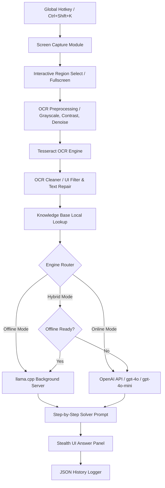

# FocusFlow 🪐

[](https://python.org)
[](https://microsoft.com/windows)
[](LICENSE)
[](online_engine.py)

FocusFlow is an ultra-stealth, hybrid offline-online educational assistance tool designed for Windows. It captures selected screen regions, runs a high-fidelity OCR preprocessing pipeline, cleans structural layout artifacts, queries local knowledge bases, and routes the context to an AI engine (either a local background `llama.cpp` model or a key-rotated OpenAI `gpt-4o` / `gpt-4o-mini` online client) to methodically solve exam and study questions in real-time.

---

## 🔮 Core Features

### 🛡️ 1. Screen Capture Evasion (Stealth HUD)
- **Zero-Window Display Affinity**: Utilizing ctypes and the Win32 API, FocusFlow applies `WDA_EXCLUDEFROMCAPTURE` dynamically to its HUD windows. The panels are completely invisible to screenshots, video recordings, and screen-sharing applications (Discord, Teams, Zoom, etc.).
- **Transparent Drag-Select**: Trigger an interactive, semi-transparent region capture overlay to target specific question areas on your monitor.

### 👁️ 2. High-Fidelity OCR Preprocessing & Cleaning
- **Multi-Stage Preprocessing Pipeline**: Converts screenshots to grayscale, boosts contrast (×1.5), sharpens, applies median noise reduction, and performs binary thresholding for near-perfect character detection under Tesseract.
- **Math Formula & Code Preservation**: Relaxed OCR cleaning logic allows full preservation of complex mathematical formulas (e.g. fraction divisions, powers) and programming declarations (e.g., matrices), preventing structural code symbols from being stripped as junk.
- **Smart Cleaner**: Collapses layout spaces, resolves typical OCR misidentifications, filters garbage/UI text (e.g. "Netlify", "Discord", "Gemini"), and strips non-printable junk characters.

### 🧠 3. Universal & Hybrid AI Solving Engine
- **Universal OpenAI-Compatible API Support**: Route queries to *any* OpenAI-compliant backend (Ollama, DeepSeek, Groq, OpenRouter) by specifying a custom API Base URL and custom model string directly in the config.
- **Offline Backend**: Launches a silent `llama-server.exe` subprocess in the background with `CREATE_NO_WINDOW` flags, serving `Phi-3-mini-4k-instruct-q4.gguf` locally. FocusFlow features automatic health checks to reuse existing/orphaned instances on the configured port.
- **Online API (`gpt-4o`/`gpt-4o-mini`)**: Integrates standard OpenAI chat completions with vision payload optimization (automatic image resizing to 1280px JPEG and quality 85 compression to reduce network latency).
- **API Key Rotation & Retry**: Supports multiple OpenAI API keys in a rotation pool, automatically rotating keys and applying exponential backoff delay during rate limits or status `429` errors.

### 📜 4. Interactive History Viewer Panel
- **Past Solves Dashboard**: Open a custom borderless history dashboard to review the last 100 interaction records, displaying structural OCR text, solver metadata, and the AI answer (with exact answer lines highlighted in vibrant green).
- **Auxiliary Screenshot Display**: Re-render saved solve screenshots inside a protected viewer window for quick reference.
- **Restore & Management**: Delete individual logs, clear all history, or restore any past solve directly back into the main HUD panel with a single click.

### 🎛️ 5. Premium Dark HUD UI
- Draggable glassmorphic borderless panels with macOS-inspired title bars.
- Live opacity slider (range 50-255) for dynamic HUD blending.
- Embedded Manual Question Drawer for quick text queries without screen capture.
- Configurable global hotkeys for capturing, panel visibility toggles, settings, and opacity adjustments.

---

## 🏗️ Architecture Flow



---

## 🚀 Detailed Setup & Installation

### Option A: Standalone Executable (Recommended)
FocusFlow is pre-compiled into a portable, standalone executable. Target machines do not need Python or standard developer runtime libraries.

#### 1. Choose & Download your Release Package
Go to the [FocusFlow Releases Page](https://github.com/adarsh0044321/focusflow/releases/tag/v1.1.0) and download one of the following bundles:
*   **Lite Release Bundle (`FocusFlow-v1.1.0-LITE.zip`)** [~77 MB]
    *   *Includes*: Pre-compiled standalone HUD executable (`FocusFlow.exe`), local Knowledge Base text sheets, local configurations, and the bundled `Tesseract-OCR` folder.
    *   *Best For*: Users who plan to solve purely via **Online Mode** (OpenAI, DeepSeek, Ollama, Groq, OpenRouter) or developers who want to download GGUF offline weights manually.
*   **Full Offline Release Bundle** [~2.4 GB]
    *   *Includes*: All files inside the Lite Bundle, **plus** preloaded local GGUF models (`models/Phi-3-mini-4k-instruct-q4.gguf`) for complete, zero-network local offline solving.
    *   *Note*: Due to large model weights, the Full Release is split into three downloadable parts:
        *   `FocusFlow-v1.1.0-FullRelease.zip.001`
        *   `FocusFlow-v1.1.0-FullRelease.zip.002`
        *   `FocusFlow-v1.1.0-FullRelease.zip.003`

#### 2. Extraction & Assembly Instructions
*   **Lite Bundle Extraction**:
    1. Right-click `FocusFlow-v1.1.0-LITE.zip` and extract it to a directory on your machine (e.g. `C:\FocusFlow`).
*   **Full Split Bundle Assembly**:
    1. Ensure all three split parts (`.001`, `.002`, `.003`) are downloaded and placed into the **same folder** on your drive.
    2. Download and install a standard extraction utility (e.g., [7-Zip](https://www.7-zip.org/) or WinRAR).
    3. Right-click the **first part** (`FocusFlow-v1.1.0-FullRelease.zip.001`) and select **7-Zip -> Extract to "FocusFlow-Release\"** (or WinRAR's equivalent).
    4. The extraction utility will automatically read the sequential headers of `.002` and `.003` and output a single, unified `FocusFlow-Release/` folder containing the entire offline suite.

#### 3. Launching FocusFlow
*   Double-click `FocusFlow.exe` in your extracted folder.
*   The application launches persistently in the background. It will automatically initialize the capture protection guard, hiding HUD windows completely from screenshot and screen-sharing utilities (invisible on Zoom, Discord, Teams, OBS, etc.).
*   Press **`Ctrl+Shift+H`** at any time to toggle HUD visibility.

---

### Option B: Running from Source (Developer Setup)

#### Prerequisites
*   **OS**: Windows 10 or 11 (essential for display affinity APIs).
*   **Python**: Version 3.9, 3.10, or 3.11 installed (ensure "Add Python to PATH" is ticked during installation).
*   **Tesseract-OCR**: Ensure the folder `Tesseract-OCR/` is located at the root of the project with the executable path `Tesseract-OCR/tesseract.exe`.

#### 1. Repository Setup & Dependencies
Clone the repository and install the standard python libraries:
```powershell
# Clone the repository
git clone https://github.com/adarsh0044321/focusflow.git
cd focusflow

# (Optional but recommended) Create a virtual environment
python -m venv venv
.\venv\Scripts\Activate.ps1

# Install requirements
pip install -r requirements.txt
```

#### 2. Running
Start the application from your console:
```powershell
python main.py
```
Log files will be generated under `logs/focusflow.log` and the configuration file will be stored in `data/settings.json`.

---

## ⚙️ Universal API Configuration Guide

FocusFlow is equipped with an OpenAI-compatible universal client that allows you to route online solves to any cloud or local LLM server. Open the Settings panel (**`Ctrl+Shift+S`**) to configure:

### 1. Standard OpenAI (ChatGPT) Setup
1. Enter one or more OpenAI API keys in the key entry and click **Add** (API keys are stored securely in `data/settings.json`).
2. Leave **Base URL** blank (defaults to primary OpenAI endpoints).
3. Select `gpt-4o` or `gpt-4o-mini` from the Model dropdown.

### 2. DeepSeek Cloud API Setup
1. Generate an API Key at [DeepSeek Platform](https://platform.deepseek.com/).
2. Enter your key in the Settings key entry and click **Add**.
3. Set **Base URL** to: `https://api.deepseek.com/v1`
4. Set **Custom Model** to: `deepseek-chat` or `deepseek-coder`

### 3. Local Ollama Integration
1. Ensure Ollama is running locally on your computer.
2. Under **Online Settings**, add any placeholder string (e.g. `ollama`) to the API Key field and click **Add**.
3. Set **Base URL** to: `http://localhost:11434/v1`
4. Set **Custom Model** to your loaded model name (e.g., `llama3`, `mistral`, or `phi3`).

### 4. Groq Cloud Setup
1. Enter your Groq API key in the key field and click **Add**.
2. Set **Base URL** to: `https://api.groq.com/openai/v1`
3. Set **Custom Model** to your desired model (e.g., `llama3-8b-8192` or `mixtral-8x7b-32768`).

---

## 🎮 How to Use & Panel Guide

FocusFlow presents a draggable HUD divided into three coordinated panels:
1.  **Pipeline Panel (Left)**: Monitors real-time OCR and LLM status. Shows chronological logs of cleaning steps, token sizes, and latency metrics.
2.  **Control Panel (Center)**: Contains action tabs to trigger region selection, view history, or open settings. Includes a manual text question entry box.
3.  **Answer Panel (Right)**: Displays the methodical step-by-step AI answers. The final choice/option is highlighted in green.

### HUD Hotkey Cheat Sheet

| Global Hotkey | Action |
|---|---|
| **`Ctrl+Shift+K`** | **Solve Target Region**: Triggers target capture, OCR preprocessing, Knowledge Base indexing, and queries the AI. |
| **`Ctrl+Shift+H`** | **Stealth Toggle**: Instantly hides/shows all FocusFlow HUD panels on-screen. |
| **`Ctrl+Shift+Z`** | **Flush HUD**: Instantly clears all text inside the Answer Panel. |
| **`Ctrl+Shift+S`** | **Settings**: Opens the configuration window to adjust opacity, models, and capture parameters. |
| **`Ctrl + .`** | **HUD Opacity Up**: Increases the solidity of HUD panels (+15 opacity). |
| **`Ctrl + ,`** | **HUD Opacity Down**: Blends HUD panels into the background for higher transparency (-15 opacity). |

---

## 📦 Creating a Production Release

To compile the codebase into a portably packed `.exe` binary:
```powershell
# Ensure PyInstaller is installed
pip install pyinstaller

# Run compilation on the custom spec file
python -m PyInstaller FocusFlow.spec --noconfirm
```
The compiled executable will be written to `dist/FocusFlow.exe`.

---

## 📄 License
This project is licensed under the MIT License - see the [LICENSE](LICENSE) file for details.
