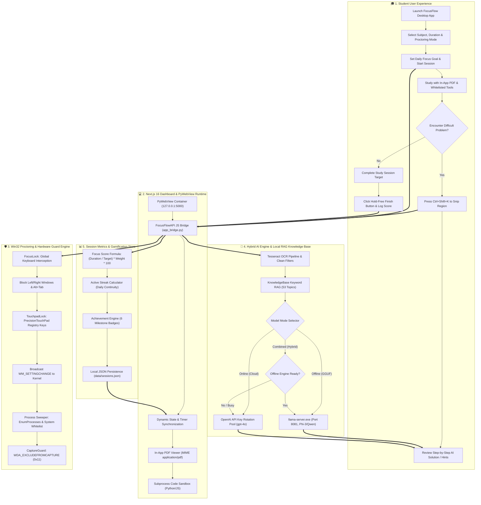
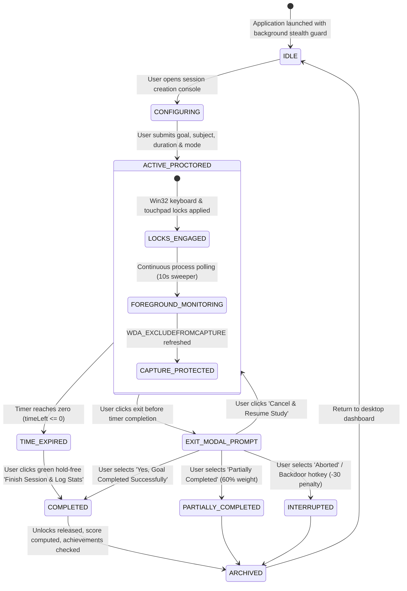
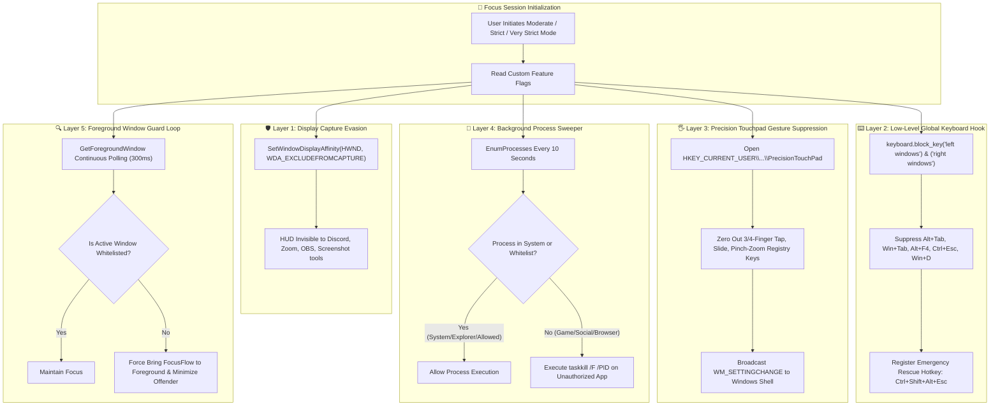

# FocusFlow 🪐⚡

**Ultra-stealth hybrid AI study companion & distraction proctoring platform with hardware locks, OCR tutoring, and local/cloud LLM intelligence.**

FocusFlow transforms Windows into an impenetrable, proctored focus environment while providing real-time AI doubt resolution, offline GGUF inference, and academic analytics.

> **CAPTURE → PREPROCESS → RETRIEVE → PROCTOR → INFER → SOLVE → LEARN**

[](https://github.com/adarsh0044321/focusflow/releases/tag/v1.4.0)
[](https://microsoft.com/windows)
[](https://www.python.org/)
[-black.svg)](https://nextjs.org/)
[](https://react.dev/)
[](https://pywebview.flowrl.com/)
[](models/)
[](LICENSE)

---

## 📦 Direct Downloads (v1.4.0 Release)

Pre-compiled production binaries configured to run out-of-the-box on Windows 10/11 (x64) without requiring Python or development toolchains:

| Application Package | Target Specification | Model Bundling | Package Download |
| :--- | :--- | :--- | :--- |
| **FocusFlow Lite** | Standard Windows x64 | Cloud / External GGUF (~77 MB) | [📥 Download FocusFlow Lite (v1.4.0)](https://github.com/adarsh0044321/focusflow/releases/download/v1.4.0/FocusFlow-v1.4.0-LITE.zip) |
| **FocusFlow Full Offline Bundle** | Complete Offline x64 | Bundled Phi-3 Mini 3.8B GGUF (~2.4 GB) | [📥 Download FocusFlow Full Bundle (v1.4.0)](https://github.com/adarsh0044321/focusflow/releases/tag/v1.4.0) |

*The complete changelog, release assets, and release verification records are available on the [Official GitHub Releases Page](https://github.com/adarsh0044321/focusflow/releases/tag/v1.4.0).*

---

## 📌 Overview & Problem Statement

High-stakes academic preparation (JEE, NEET, UPSC, University finals, and technical certifications) regularly suffers from desktop distraction and fragmented tools:
* **Pervasive Desktop Distractions**: Notification popups, social media rabbit holes, background games, and accidental Alt-Tab multitasking destroy deep concentration states and focus flow.
* **Proctoring Deficits & Trivial Bypasses**: Standard website blockers are easily bypassed using task managers, virtual desktops, touchpad gestures, or secondary browser shortcuts without accountability.
* **Privacy & Connectivity Hazards**: Cloud-only AI study assistants require persistent internet connectivity, expose sensitive study notes to third-party servers, and stall during library or campus network drops.
* **Superficial Study Logging & "Ghost" Sessions**: Passive timers and manual check-ins fail to penalize aborted study intervals, record unverified "fake" sessions, and provide zero correlation between focus depth and retention.

**FocusFlow** replaces fragmented desktop study utilities with an enterprise-grade, hardware-proctored educational operating environment. It combines low-level Windows kernel/Win32 proctoring (transparent display capture exclusion, global keyboard interception, precision touchpad gesture locks, and automated unauthorized process termination) with high-fidelity local OCR, RAG textbook context retrieval, and a flexible hybrid AI engine (offline GGUF via llama.cpp or cloud LLMs via OpenAI).

---

## 📸 Application Interface Tour

Interactive view of FocusFlow's study environment and proctoring HUD:

### 🎓 1. Focus Proctoring & Study Operating Environment

| Immersive Fullscreen Dashboard | Dynamic Whitelist & Coding App | Smart Early-Exit Verification |
| :---: | :---: | :---: |
|  |  |  |
| *Glassmorphic proctoring HUD* | *Moderate Mode CS app selector* | *Hold-free & penalized exit states* |

| In-App Inline PDF Reader | Background Media & Spotify HUD | Daily Goals & Streak Vitals |
| :---: | :---: | :---: |
|  |  |  |
| *Native WebView2 document viewer* | *Hardware media key controller* | *Study streaks & gamified achievements* |

---

### 🧠 2. AI Doubts Solver & Academic Utilities

| Region Screen Capture & OCR | Socratic AI Tutor & Personas | Custom GGUF Model Manager |
| :---: | :---: | :---: |
|  |  |  |
| *High-fidelity character detection* | *4 tailored solving personas* | *Native Windows file dialog & RAM guide* |

| Safe Python/JS Code Sandbox | Academic Notes & Flashcards | Productivity & Focus Analytics |
| :---: | :---: | :---: |
|  |  |  |
| *Subprocess code executor (5s timeout)* | *RAG context injection from local notes* | *Weekly line graphs & hourly heatmaps* |

---

## 🔄 Detailed Operational Flowcharts

### 1. End-to-End Operational Lifecycle & Actor Interaction
The following diagram illustrates how a study session travels through configuration, proctoring lock enforcement, RAG retrieval, hybrid AI inference, and analytics calculation:


```mermaid
flowchart TD
    subgraph Student["🎓 1. Student User Experience"]
        A1["Launch FocusFlow Desktop App"] --> A2["Select Subject, Duration & Proctoring Mode"]
        A2 --> A3["Set Daily Focus Goal & Start Session"]
        A3 --> A4["Study with In-App PDF & Whitelisted Tools"]
        A4 --> A5{"Encounter Difficult Problem?"}
        A5 -- "Yes" --> A6["Press Ctrl+Shift+K to Snip Region"]
        A6 --> A7["Review Step-by-Step AI Solution / Hints"]
        A5 -- "No" --> A8["Complete Study Session Target"]
        A8 --> A9["Click Hold-Free Finish Button & Log Score"]
    end

    subgraph Frontend["💻 2. Next.js 16 Dashboard & PyWebView Runtime"]
        B1["PyWebView Container (127.0.0.1:5000)"] --> B2["FocusFlowAPI JS Bridge (app_bridge.py)"]
        B2 --> B3["Dynamic State & Timer Synchronization"]
        B3 --> B4["In-App PDF Viewer (MIME application/pdf)"]
        B4 --> B5["Subprocess Code Sandbox (Python/JS)"]
    end

    subgraph Proctoring["🛡️ 3. Win32 Proctoring & Hardware Guard Engine"]
        C1["FocusLock: Global Keyboard Interception"] --> C2["Block Left/Right Windows & Alt+Tab"]
        C2 --> C3["TouchpadLock: PrecisionTouchPad Registry Keys"]
        C3 --> C4["Broadcast WM_SETTINGCHANGE to Kernel"]
        C4 --> C5["Process Sweeper: EnumProcesses & System Whitelist"]
        C5 --> C6["CaptureGuard: WDA_EXCLUDEFROMCAPTURE (0x11)"]
    end

    subgraph AIInference["🤖 4. Hybrid AI Engine & Local RAG Knowledge Base"]
        D1["Tesseract OCR Pipeline & Clean Filters"] --> D2["KnowledgeBase Keyword RAG (53 Topics)"]
        D2 --> D3{"Model Mode Selector"}
        D3 -- "Offline (GGUF)" --> D4["llama-server.exe (Port 8081, Phi-3/Qwen)"]
        D3 -- "Online (Cloud)" --> D5["OpenAI API Key Rotation Pool (gpt-4o)"]
        D3 -- "Combined (Hybrid)" --> D6{"Offline Engine Ready?"}
        D6 -- "Yes" --> D4
        D6 -- "No / Busy" --> D5
    end

    subgraph Analytics["📊 5. Session Metrics & Gamification Store"]
        E1["Focus Score Formula: (Duration / Target) * Weight * 100"] --> E2["Active Streak Calculator (Daily Continuity)"]
        E2 --> E3["Achievement Engine (6 Milestone Badges)"]
        E3 --> E4["Local JSON Persistence (data/sessions.json)"]
    end

    A3 ==> B2
    B2 ==> C1
    A6 ==> B2
    B2 ==> D1
    D4 ==> A7
    D5 ==> A7
    A9 ==> B2
    B2 ==> E1
    E4 ==> B3
```

---

### 2. Deterministic Focus Session State Machine Flowchart
FocusFlow enforces strict, predictable session states to prevent evasion, unauthorized exits, and score tampering:


```mermaid
stateDiagram-v2
    [*] --> IDLE : Application launched with background stealth guard
    
    IDLE --> CONFIGURING : User opens session creation console
    
    CONFIGURING --> ACTIVE_PROCTORED : User submits goal, subject, duration & mode
    
    state ACTIVE_PROCTORED {
        [*] --> LOCKS_ENGAGED : Win32 keyboard & touchpad locks applied
        LOCKS_ENGAGED --> FOREGROUND_MONITORING : Continuous process polling (10s sweeper)
        FOREGROUND_MONITORING --> CAPTURE_PROTECTED : WDA_EXCLUDEFROMCAPTURE refreshed
    }
    
    ACTIVE_PROCTORED --> TIME_EXPIRED : Timer reaches zero (timeLeft <= 0)
    ACTIVE_PROCTORED --> EXIT_MODAL_PROMPT : User clicks exit before timer completion
    
    EXIT_MODAL_PROMPT --> ACTIVE_PROCTORED : User clicks 'Cancel & Resume Study'
    EXIT_MODAL_PROMPT --> COMPLETED : User selects 'Yes, Goal Completed Successfully'
    EXIT_MODAL_PROMPT --> PARTIALLY_COMPLETED : User selects 'Partially Completed' (60% weight)
    EXIT_MODAL_PROMPT --> INTERRUPTED : User selects 'Aborted' / Backdoor hotkey (-30 penalty)
    
    TIME_EXPIRED --> COMPLETED : User clicks green hold-free 'Finish Session & Log Stats'
    
    COMPLETED --> ARCHIVED : Unlocks released, score computed, achievements checked
    PARTIALLY_COMPLETED --> ARCHIVED
    INTERRUPTED --> ARCHIVED
    
    ARCHIVED --> IDLE : Return to desktop dashboard
```

---

### 3. Multi-Layer Win32 Proctoring & Display Evasion Flowchart
To safeguard students from impulsive distractions while guaranteeing exam integrity:


```mermaid
flowchart TD
    subgraph Trigger["🎯 Focus Session Initialization"]
        INIT["User Initiates Moderate / Strict / Very Strict Mode"] --> EVAL["Read Custom Feature Flags"]
    end

    subgraph Layer1["🛡️ Layer 1: Display Capture Evasion"]
        EVAL --> L1["SetWindowDisplayAffinity(HWND, WDA_EXCLUDEFROMCAPTURE)"]
        L1 --> L1_RES["HUD Invisible to Discord, Zoom, OBS, Screenshot tools"]
    end

    subgraph Layer2["⌨️ Layer 2: Low-Level Global Keyboard Hook"]
        EVAL --> L2["keyboard.block_key('left windows') & ('right windows')"]
        L2 --> L2_SUPP["Suppress Alt+Tab, Win+Tab, Alt+F4, Ctrl+Esc, Win+D"]
        L2_SUPP --> L2_BACKDOOR["Register Emergency Rescue Hotkey: Ctrl+Shift+Alt+Esc"]
    end

    subgraph Layer3["🖐️ Layer 3: Precision Touchpad Gesture Suppression"]
        EVAL --> L3["Open HKEY_CURRENT_USER\\...\\PrecisionTouchPad"]
        L3 --> L3_REG["Zero Out 3/4-Finger Tap, Slide, Pinch-Zoom Registry Keys"]
        L3_REG --> L3_SEND["Broadcast WM_SETTINGCHANGE to Windows Shell"]
    end

    subgraph Layer4["🧹 Layer 4: Background Process Sweeper"]
        EVAL --> L4["EnumProcesses Every 10 Seconds"]
        L4 --> L4_SAFE{"Process in System or Whitelist?"}
        L4_SAFE -- "Yes (System/Explorer/Allowed)" --> L4_KEEP["Allow Process Execution"]
        L4_SAFE -- "No (Game/Social/Browser)" --> L4_KILL["Execute taskkill /F /PID on Unauthorized App"]
    end

    subgraph Layer5["🔍 Layer 5: Foreground Window Guard Loop"]
        EVAL --> L5["GetForegroundWindow Continuous Polling (300ms)"]
        L5 --> L5_CHECK{"Is Active Window Whitelisted?"}
        L5_CHECK -- "Yes" --> L5_OK["Maintain Focus"]
        L5_CHECK -- "No" --> L5_RESTORE["Force Bring FocusFlow to Foreground & Minimize Offender"]
    end
```

---

## 🏗️ Core Modules & Architectural Features

### 🛡️ 1. Win32 Proctoring & Hardware-Level Distraction Shield (`main.py`, `guard.py`)
- **Zero-Window Display Affinity**: Injects `WDA_EXCLUDEFROMCAPTURE` (0x00000011) directly into the PyWebView2 handle via `ctypes.windll.user32.SetWindowDisplayAffinity`. HUD overlays are completely transparent to screen-sharing software (Zoom, Teams, Discord) and screen recording capture cards.
- **Hardware Keyboard Interception (`FocusLock`)**: Uses low-level Windows keyboard hooks to intercept and suppress multitasking keystrokes: `Alt+Tab`, `Win+Tab`, `Alt+F4`, `Ctrl+Esc`, `Ctrl+Shift+Esc`, `Win+D`, and virtual desktop navigation (`Ctrl+Win+Left/Right`).
- **Precision Touchpad Lockout (`TouchpadLock`)**: Automatically modifies Windows Precision Touchpad registry parameters under `HKCU\Software\Microsoft\Windows\CurrentVersion\PrecisionTouchPad` to disable three-finger and four-finger multitasking gestures, followed by a system-wide `WM_SETTINGCHANGE` broadcast.
- **Automated Process Sweeper**: Evaluates running processes via `win32process.EnumProcesses()`, whitelisting essential system binaries (`C:\Windows\...`) while actively terminating distracting user applications with `taskkill /F`.
- **Dynamic Coding Application Whitelist**: In Moderate Mode, when the subject is "Computer Science", users can dynamically whitelist their installed IDE (`Code.exe`, `python.exe`, `pycharm64.exe`, `idle.exe`, `notepad++.exe`) without breaking the proctoring envelope.
- **Emergency Rescue Backdoor**: Safe escape hatch (`Ctrl+Shift+Alt+Esc`) allowing users to safely disengage proctoring locks in emergency situations while applying a fair focus score penalty.

---

### 👁️ 2. High-Fidelity OCR & Mathematical Text Processing (`screen_capture.py`, `ocr_engine.py`, `ocr_cleaner.py`)
- **Interactive Region Snip**: Low-latency screen region capture powered by `mss` with DPI-aware coordinate transformations and multi-monitor support.
- **Multi-Stage Preprocessing Pipeline**:
  - 8-bit Grayscale conversion for character isolation.
  - Dynamic contrast enhancement (boost factor 1.5×).
  - Unsharp masking and median filtering to eliminate subpixel font anti-aliasing noise.
  - Adaptive binary thresholding tuned for high character accuracy in Tesseract.
- **Intelligent Text & Math Cleaner (`OCRCleaner`)**:
  - Removes Unicode junk characters, zero-width control spaces, and website chrome artifacts (`"Cookie Policy"`, `"Sign In"`, `"Sponsored"`).
  - **Mathematical Notation Preservation**: Whitelists algebraic, trigonometric, and calculus notations (`+-*/=^√∫∂∆%±≤≥≠≈∝()[]{}<>`) to ensure mathematical identities and formulas are preserved.
  - OCR substitution error repair (e.g. pipe symbol `|` inside English words corrected to `l` or `I`).

---

### 🧠 3. Hybrid AI Engine & Socratic Doubts Solver (`ai_engine.py`, `offline_engine.py`, `online_engine.py`, `knowledge_base.py`)
- **Strict Lazy Subprocess Lifecycle**: The offline LLM engine (`llama-server.exe`) starts up dynamically only when the user opens the AI Doubts Solver panel, reclaiming up to 2.4 GB of physical RAM immediately when the solver is closed.
- **Native GGUF Model Selector**: Topmost Windows Open File dialog enabling users to select custom quantized `.gguf` models stored anywhere on their system, persisting absolute paths to `settings.json`.
- **Hardware-Calibrated RAM Profiles**:
  - **Phi-3 Mini 3.8B (Default)**: Recommended for setups with **8GB+ RAM** (~2.2 GB).
  - **Qwen-2.5 1.5B (Low-Spec)**: Ultra-fast model recommended for **4GB–6GB RAM** (~900 MB).
  - **Llama-3 8B (High-Spec)**: Comprehensive reasoning model for **16GB+ RAM** (~4.7 GB).
- **RAG Knowledge Base Context Injection**: Scans 53 subject reference texts in `knowledge_base/` covering high-school and university STEM topics (Kinematics, Calculus, Thermodynamics, Organic Chemistry, etc.). Features whole-word frequency matching and an English stop-word filter.
- **4 Tailored Academic Solving Personas**:
  - **Exam Solver**: Methodical, step-by-step numerical breakdown with explicit final answers.
  - **Socratic Tutor**: Concept-first guidance that asks leading questions without spoiling answers.
  - **Code Mentor**: Syntactically clean, time/space complexity analysis and formatted code blocks.
  - **Language & Literature Expert**: Grammatical breakdowns, linguistic origins, and literary context.
- **Cloud Failover & API Key Rotation**: Rotates through a pool of configured OpenAI API keys with exponential backoff and automatic fallback if the local model is busy or loading.

---

### 💻 4. Modern React / Next.js Desktop Dashboard (`landing/`)
- **Turbopack-Compiled Next.js 16**: High-performance static export (`landing/out`) served locally on `127.0.0.1:5000` via Python's multithreaded HTTP daemon.
- **Embedded In-App PDF Reader**: Dynamic MIME type registration (`application/pdf`) allowing students to view lecture slides, textbooks, and problem sheets inline inside WebView2 without triggering external Chrome downloads.
- **Integrated Code Sandbox**: Run Python, JavaScript, and HTML snippets inside a secure, sandboxed execution environment with a 5-second execution timeout to prevent runaway loops.
- **Native Spotify Media Controls**: Hardware media key simulation (`VK_MEDIA_PLAY_PAUSE`, `VK_MEDIA_NEXT_TRACK`, `VK_MEDIA_PREV_TRACK`) for controlling background study music.
- **Gamified Consistency Analytics**: Tracks total study hours, active consecutive day streaks, hourly productivity charts, and milestone achievement badges (`First Step`, `Deep Diver`, `Unstoppable`, `Academic Weapon`, `Early Bird`, `Night Owl`).

---

## 🛠️ Complete PyWebView API Bridge Directory

All methods exposed directly to the React frontend through `window.pywebview.api`:

| Method | Bridge Endpoint | Access Scope | Description |
| :--- | :--- | :--- | :--- |
| `POST` | `start_focus_session` | Dashboard | Engages proctoring locks, initializes timers, and logs active recovery state |
| `POST` | `stop_focus_session` | Dashboard | Releases Win32 locks, calculates focus score, and saves session metrics |
| `GET` | `get_active_session` | Startup | Checks for interrupted or crashed focus sessions to offer instant recovery |
| `GET` | `get_stats` | Analytics | Returns total hours, streak, focus scores, weekly graphs, and achievements |
| `GET` | `get_daily_goals` | Checklist | Fetches daily study goals for the current calendar date |
| `POST` | `add_daily_goal` | Checklist | Adds a new study checklist task with unique timestamp identifier |
| `POST` | `toggle_daily_goal` | Checklist | Toggles completion status of a daily goal |
| `POST` | `delete_daily_goal` | Checklist | Deletes a task from the daily checklist |
| `POST` | `query_ai_assistant` | AI Solver | Routes formatted academic prompt to hybrid AI engine with local RAG context |
| `POST` | `trigger_ocr_capture` | HUD | Launches interactive region snip tool on an asynchronous background thread |
| `POST` | `spotify_action` | Media HUD | Sends simulated virtual media keypresses (`play_pause`, `next`, `prev`) |
| `GET` | `get_settings` | Settings | Retrieves compiled application configuration dictionary from `ConfigManager` |
| `POST` | `save_settings` | Settings | Persists updated configurations and updates window opacity in real-time |
| `POST` | `open_model_selector` | Settings | Opens topmost native Windows file dialog to select local custom `.gguf` models |
| `POST` | `open_file_explorer` | Proctoring | Spawns Windows File Explorer when permitted in Moderate/Strict modes |
| `POST` | `open_pdf_selector` | Study Tools | Native file dialog to load study PDFs into the inline WebView2 viewport |
| `POST` | `on_ai_panel_visibility_changed` | AI Lifecycle | Triggers lazy startup or termination of `llama-server.exe` to free RAM |
| `POST` | `run_code` | Sandbox | Executes Python code inside a sandboxed subprocess with a 5-second timeout |
| `POST` | `minimize_window` | System | Minimizes the main FocusFlow desktop window |
| `POST` | `close_window` | System | Performs full cleanup of keyboard hooks, touchpad registry, and terminates app |

---

## 💻 Technology Stack Reference

| Layer | Technology | Purpose |
| :--- | :--- | :--- |
| **Desktop Shell & Container** | Python 3.10+, PyWebView 5.0+ | Lightweight native Windows GUI container with zero Node.js runtime overhead |
| **Frontend Framework** | Next.js 16.2 (Turbopack), React 19, TypeScript | High-performance dashboard, interactive widgets, animations, and routing |
| **Styling & Motion** | TailwindCSS v4, Framer Motion, Lucide Icons | Dark glassmorphic aesthetic, ambient glows, fluid micro-interactions |
| **Proctoring & System Hooks** | Win32 API, `ctypes`, `pywin32`, `keyboard`, `winreg` | `WDA_EXCLUDEFROMCAPTURE`, global keyboard suppression, PrecisionTouchPad locks |
| **OCR & Vision** | Tesseract-OCR 5.x, Pillow, `mss` | Ultra-fast multi-monitor screen grabs, image preprocessing, and text extraction |
| **Offline LLM Inference** | `llama.cpp` (`llama-server.exe`), GGUF | Local, private AI inference running entirely on consumer hardware |
| **Cloud AI Integration** | OpenAI API (`gpt-4o`, `gpt-4o-mini`), HTTP Requests | High-speed cloud reasoning with automated API key rotation pool |
| **RAG Knowledge Base** | Custom In-Memory Keyword Stemmer & Vectorizer | 53 curated STEM reference textbooks for automated context injection |
| **Database & Persistence** | Structured Flat JSON (`settings.json`, `sessions.json`, `daily_goals.json`) | Zero-dependency, portable, local-first user configuration and analytics |
| **Packaging & Build** | PyInstaller 6.x (`FocusFlow.spec`), Batch Scripts | Bundles Python runtime, Next.js assets, OCR, and llama.cpp into a single executable |

---

## 📂 Verified Project Structure

```text
FocusFlow/
├── data/                               # Local JSON database and runtime storage
│   ├── daily_goals.json                # User checklist items and daily goals
│   ├── sessions.json                   # Logged study sessions with focus scores
│   ├── settings.json                   # Application configuration and active parameters
│   └── screenshots/                    # Archived study screen captures
├── knowledge_base/                     # 53 plain-text STEM reference notes for RAG
│   ├── applications_derivatives.txt    # Calculus: derivative tests & optimization
│   ├── atomic_structure.txt            # Chemistry: Bohr model & quantum numbers
│   ├── kinematics.txt                  # Physics: motion equations & projectile paths
│   └── ...                             # Remaining 50 subject reference files
├── landing/                            # Modern Next.js 16 Web Dashboard
│   ├── src/app/                        # Next.js App Router source code
│   │   ├── dashboard/page.tsx          # Main FocusFlow Desktop HUD & Proctoring View
│   │   ├── layout.tsx                  # Global HTML metadata and font layout
│   │   └── page.tsx                    # Interactive SaaS product showcase landing page
│   ├── out/                            # Production-compiled static HTML/JS/CSS assets
│   ├── build.bat                       # Portable Next.js compilation script
│   ├── package.json                    # Frontend dependencies & Next.js scripts
│   └── tsconfig.json                   # Strict TypeScript compiler options
├── llama.cpp-master/                   # Bundled llama.cpp offline server distribution
│   └── llm/llama-server.exe            # Background silent GGUF inference executable
├── models/                             # Local GGUF instruction model weights
│   └── Phi-3-mini-4k-instruct-q4.gguf  # Default lightweight 3.8B model weights
├── Tesseract-OCR/                      # Bundled Tesseract optical character engine
│   ├── tesseract.exe                   # Core OCR binary
│   └── tessdata/                       # Trained language datasets (eng.traineddata)
├── ai_engine.py                        # Unified AI routing logic (Offline / Online / Combined)
├── app_bridge.py                       # PyWebView JS-to-Python execution bridge
├── config_manager.py                   # Configuration manager with defaults merging & path resolution
├── guard.py                            # CaptureGuard: Win32 display affinity exclusion daemon
├── history_manager.py                  # Search logs, achievements, and OCR history tracker
├── main.py                             # Master application entry point and lifecycle controller
├── ocr_cleaner.py                      # OCR text repair, noise reduction, and math equation preserver
├── ocr_engine.py                       # Tesseract wrapper with image preprocessing filters
├── offline_engine.py                   # llama-server subprocess manager with health monitoring
├── online_engine.py                    # OpenAI client with API key rotation and vision compression
├── screen_capture.py                   # Multi-monitor DPI-aware screen region capture
├── session_manager.py                  # Focus session logger, streaks, and score calculations
├── requirements.txt                    # Python runtime dependencies
├── FocusFlow.spec                      # PyInstaller packaging specification
├── release_notes.md                    # Detailed version history and changelog
├── test_session_manager.py             # Unit tests for session calculations & streaks
├── test_fixes.py                       # Unit tests for bug fixes and AI engine routing
├── test_features.py                    # Unit tests for OCR cleaner & RAG stop-words
├── test_system.py                      # End-to-end subsystem integration test suite
├── LICENSE                             # MIT Open Source License
└── README.md                           # Master Project Documentation
```

---

## 🚀 Getting Started & Local Development

### Prerequisites
* **Operating System**: Windows 10 / 11 (64-bit).
* **Python**: Version **3.10** or **3.11** (recommended: [Python.org](https://www.python.org/downloads/)).
* **Node.js**: Version **18.x** or higher (for compiling Next.js dashboard assets).
* **Administrative Privileges**: Recommended for low-level Win32 keyboard blocking and PrecisionTouchPad gesture control.

---

### 1. Clone & Environment Setup
```powershell
git clone https://github.com/adarsh0044321/focusflow.git
cd focusflow

# Create and activate a Python virtual environment:
python -m venv venv
.\venv\Scripts\activate

# Install required Python dependencies:
pip install -r requirements.txt
```

---

### 2. Compile Frontend Static Assets
FocusFlow serves a compiled Next.js dashboard directly from `landing/out`. Before running the Python application from source, compile the latest frontend build:
```powershell
cd landing
npm install
.\build.bat
cd ..
```
*Verification: Ensure `landing/out/index.html` and `landing/out/dashboard/index.html` exist.*

---

### 3. Run FocusFlow from Source
Start the application using the master controller:
```powershell
# Combined / Hybrid Mode (Default - offline with online fallback):
python main.py

# Online-Only Mode (Bypasses llama.cpp to save physical RAM):
python main.py --mode online

# Offline-Only Mode (Restricts queries to local GGUF models):
python main.py --mode offline
```

---

### 4. GGUF Model Setup & RAM Specifications (Offline Mode)
To use local offline AI assistance, download an instruction-tuned GGUF model:

* **Phi-3 Mini 3.8B (Default)** [~2.2 GB]: Recommended for systems with **8GB+ RAM**.  
  [📥 Download Phi-3 Mini GGUF](https://huggingface.co/microsoft/Phi-3-mini-4k-instruct-gguf)
* **Qwen-2.5 1.5B (Low-Spec)** [~900 MB]: Recommended for systems with **4GB–6GB RAM**.  
  [📥 Download Qwen-2.5 1.5B GGUF](https://huggingface.co/Qwen/Qwen2.5-1.5B-Instruct-GGUF)
* **Llama-3 8B (High-Spec)** [~4.7 GB]: Recommended for systems with **16GB+ RAM**.  
  [📥 Download Llama-3 8B GGUF](https://huggingface.co/MaziyarPanahi/Meta-Llama-3-8B-Instruct-GGUF)

**Zero-Configuration Integration**:
1. Save the downloaded `.gguf` file anywhere on your computer (e.g., `models/` or your `Downloads` folder).
2. Open Settings (**`Ctrl+Shift+S`**), navigate to **Offline AI GGUF Models**, and click **Browse GGUF**.
3. Select your `.gguf` file. FocusFlow automatically resolves the absolute path and updates settings with zero manual file copying.

---

### 5. Building the Standalone Windows Executable
To package FocusFlow into a standalone, single-folder executable using PyInstaller:
```powershell
python -m PyInstaller FocusFlow.spec --noconfirm
```
*The packaged application bundle will be created under `dist/FocusFlow/`.*

---

## 🎮 Global Hotkeys & Keyboard Control Map

FocusFlow operates persistently with low-latency global shortcuts:

| Hotkey | Global Action | Description |
| :--- | :--- | :--- |
| **`Ctrl + Shift + K`** | Snip & Solve | Triggers interactive screen region capture, runs OCR, and queries AI |
| **`Ctrl + Shift + H`** | Toggle HUD | Instantly hides or shows the FocusFlow floating desktop HUD |
| **`Ctrl + Shift + S`** | Open Settings | Opens the configuration modal for model selection, hotkeys, and opacity |
| **`Ctrl + Shift + Z`** | Clear View | Resets the active AI answer view and clears temporary OCR buffers |
| **`Ctrl + .`** | Increase Opacity | Increases HUD opacity (makes panels more solid and visible) |
| **`Ctrl + ,`** | Decrease Opacity | Decreases HUD opacity (makes panels more transparent and subtle) |
| **`Ctrl + Shift + Alt + Esc`** | Emergency Backdoor | Emergency disengagement of all proctoring locks (applies score penalty) |

---

## 🧪 Automated Testing & Verification

FocusFlow includes a comprehensive unit and integration test suite covering proctoring state transitions, OCR text cleaning, AI routing, and system recovery:

```powershell
# Run the complete test suite:
python -m unittest test_session_manager.py test_fixes.py test_features.py test_system.py
```

### Verified Test Suite Breakdown
* **`test_session_manager.py`**: Verifies focus score calculation formulas, streak continuity rules across calendar boundaries, and achievement unlock triggers.
* **`test_fixes.py`**: Asserts effective AI routing across offline, online, and combined modes, prevents process resource leaks, and verifies keyword substring safety.
* **`test_features.py`**: Tests English stop-word filtering in the RAG knowledge base and asserts preservation of mathematical formulas (`(x+y)*(x-y) = x^2 - y^2`) in `OCRCleaner`.
* **`test_system.py`**: End-to-end integration test validating subsystem initialization across `ConfigManager`, `OCREngine`, `OCRCleaner`, `KnowledgeBase`, and `AIEngine`.

*Result: **17/17 tests passing** (0 failures, 0 errors).*

---

## 🗺️ Roadmap

Planned milestones and architectural enhancements for upcoming releases:
* **v1.5.0**:
  * **Encrypted Cloud Sync**: Optional end-to-end encrypted backup for study logs and daily goals.
  * **Peer Study Heatmaps**: Privacy-preserving study consistency sharing with study groups.
* **v1.6.0**:
  * **Dynamic CPU Thread Allocation**: Real-time adjustment of `llama-server.exe` threads based on active CPU load.
  * **Voice-Based Doubts Input**: Local speech-to-text dictation using Whisper.cpp for fast question inputs.
  * **Integrated Lo-Fi Audio Engine**: Built-in ambient background study sounds (binaural beats, rain, library ambience).

---

## 🔒 Security & Proctoring Integrity

FocusFlow adheres to strict defense-in-depth principles:
* **Display Capture Evasion**: Uses hardware-level Win32 `SetWindowDisplayAffinity` (`WDA_EXCLUDEFROMCAPTURE`) to ensure HUD windows are never leaked during screen recordings or remote video calls.
* **Hardware Input Suppression**: Suppresses system-level multitasking shortcuts directly in the Windows message queue to prevent distraction switching.
* **Safe Registry Restoration**: Backs up all PrecisionTouchPad registry keys before modifying gesture states and restores original settings upon session exit or application cleanup.
* **Sandboxed Code Execution**: Subprocess execution for user scripts features an isolated working directory and a strict 5-second execution timeout.
* **Zero Credential Leaks**: API keys are stored locally in `data/settings.json` and are strictly excluded from git tracking via `.gitignore`.

---

## 🤝 Contributing

Contributions, feature requests, and issue reports are welcome:
1. Fork the repository.
2. Create a dedicated feature branch (`git checkout -b feature/amazing-feature`).
3. Commit your changes with clear messages (`git commit -m "feat: add support for custom prompt templates"`).
4. Run the automated test suite to ensure zero regressions (`python -m unittest ...`).
5. Push to your branch (`git push origin feature/amazing-feature`).
6. Open a Pull Request with a clear explanation of changes and test evidence.

---

## 📄 License

Distributed under the **MIT License**. See [`LICENSE`](LICENSE) for complete terms.

---

## 👨‍💻 Author

**Adarsh Kumar Singh**  
*Built as an independent software project focused on applying AI and low-level system proctoring to modern focused learning.*
